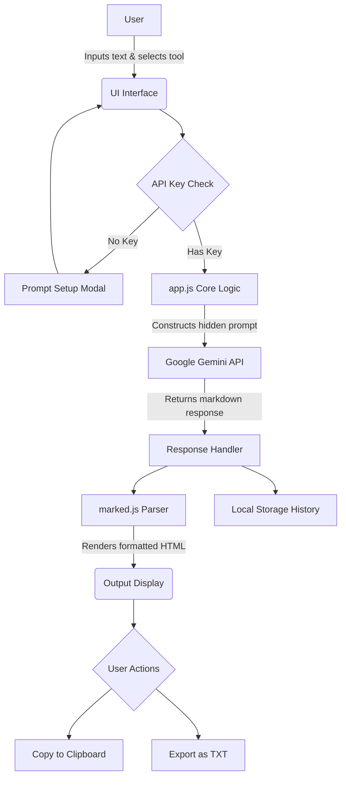

<div align="center">
  
# 🎓 StudyAI Pro

[](https://krrish-cypto.github.io/study-ai-pro/)
<br>

**Tech Stack:**
<br>


<br>
<i>An intelligent, completely client-side AI student assistant built to help students process, understand, and plan their studies.</i>

</div>

---

## ✨ Features

- 📝 **Note Summarizer**: Condenses long study notes into key bullet points.
- 💡 **Concept Explainer**: Explains complex topics clearly with real-world examples.
- 🎯 **Quiz Generator**: Automatically generates short, multiple-choice quizzes from provided text.
- ✍️ **Answer Improver**: Reviews draft answers and provides constructive feedback and a polished version.
- 📅 **Schedule Maker**: Creates structured study timetables based on topics and available time.
- 💾 **Local History**: Automatically saves your past AI generations to the browser's `localStorage` so you never lose your work.
- 📤 **Export Tools**: One-click "Copy to Clipboard" and "Export as TXT" functionality.
- 🔐 **Bring-Your-Own-Key (BYOK)**: Securely authenticates users using their personal Gemini API key.

---

## 🚀 How to Run Locally

Since this project is completely client-side, running it locally is incredibly simple.

1. **Clone the repository:**
   ```bash
   git clone https://github.com/krrish-cypto/study-ai-pro.git
   cd study-ai-pro
   ```

2. **Start a local server:**
   You can use any local web server to run the application. For example, if you have Python installed, open your terminal in the project folder and run:
   ```bash
   python -m http.server 8000
   ```

3. **Open your browser:**
   Navigate to `http://localhost:8000`

4. **Enter your API Key:**
   When the app loads, it will prompt you for a Google Gemini API Key. You can get one for free at [Google AI Studio](https://aistudio.google.com/).

---

## 🔄 Architecture & Flow Diagram

Below is the workflow diagram illustrating how data moves through the application from the user input to the final AI generation.



---
<div align="center">
  <b>Built with ❤️ by Krishna Dubey</b>
  <br>
  <i>Beginner Level task for the AI Engineer Internship at ShadowFox</i>
</div>
