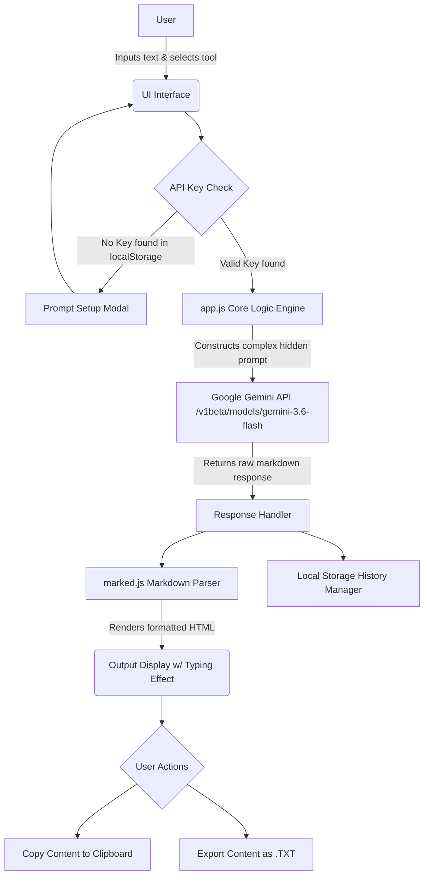

<div align="center">
  
# 🎓 StudyAI Pro

[](https://krrish-cypto.github.io/study-ai-pro/)
<br>

**Tech Stack:**
<br>


<br>
<i>An intelligent, completely client-side AI student assistant built to help students process, understand, and plan their studies.</i>

</div>

---

## 📋 Internship Project Overview

This project was developed as the **Beginner Level Task** for the AI Engineer Internship at ShadowFox. The primary goal of this track is to evaluate fundamental AI application development skills, including API integration, prompt-based thinking, UI design, validation, and error handling.

### Fulfillment of Required Tasks:
1. **Core Application Concept**: Built an AI-powered student utility app that acts as a practical workflow rather than a generic chatbot.
2. **Note Summarisation**: Implemented a tool that takes raw, unstructured text and extracts key bullet points.
3. **Quiz Generation**: Implemented a tool that generates multiple-choice questions for self-assessment based on uploaded context.
4. **Answer Improvement**: Added a feature that analyzes a student's draft answers and suggests constructive improvements.
5. **Basic Validation**: Added empty-state validation to prevent empty API calls.
6. **Output Handling**: Properly catches, handles, and displays API errors (such as invalid keys or unsupported models) gracefully in the UI.
7. **Clean User Flow**: Designed an intuitive, glassmorphism UI with clear navigation, interactive typing-effect rendering, and a secure Bring-Your-Own-Key (BYOK) setup process.

---

## ✨ Comprehensive Feature Set

In addition to the mandatory requirements, the following features were engineered to create a more robust product:

- 📝 **Note Summarizer**: Condenses long, complex study notes into easily digestible key bullet points.
- 💡 **Concept Explainer**: Explains highly complex topics clearly, using analogies and real-world examples.
- 🎯 **Quiz Generator**: Automatically generates short, multiple-choice quizzes (complete with an answer key) from provided textbook text.
- ✍️ **Answer Improver**: Reviews draft answers, corrects grammar, and provides constructive feedback alongside a polished version.
- 📅 **Schedule Maker**: Creates structured, realistic study timetables based on specific topics and the student's available time.
- 💾 **Local History Storage**: Automatically saves past AI generations to the browser's `localStorage` so students never lose their important work upon refreshing the page.
- 📤 **Export Capabilities**: Includes one-click "Copy to Clipboard" and "Export as TXT" functionality for easy sharing of study materials.
- 🔐 **Secure API Key Management**: Utilizes a secure, local-only authentication modal where users input their personal Gemini API key. The key is never sent to any external server other than Google.

---

## 🚀 How to Run Locally

Because this architecture is completely client-side (frontend only), running it locally is incredibly simple.

1. **Clone the repository:**
   ```bash
   git clone https://github.com/krrish-cypto/study-ai-pro.git
   cd study-ai-pro
   ```

2. **Start a local web server:**
   You must serve the files using a local server due to browser CORS policies. 
   - *If you have Python installed*, open your terminal in the project folder and run:
     ```bash
     python -m http.server 8000
     ```
   - *If you use Node.js/npm:*
     ```bash
     npx serve .
     ```

3. **Open your browser:**
   Navigate to `http://localhost:8000`

4. **Enter your API Key:**
   When the app initially loads, a modal will prompt you for a Google Gemini API Key. You can acquire one for free at [Google AI Studio](https://aistudio.google.com/).

---

## 🔄 Architecture & Flow Diagram

Below is the workflow diagram illustrating how data systematically moves through the application from the user input phase to the final AI generation rendering.



---
<div align="center">
  <b>Built by Krishna Dubey</b>
  <br>
  <i>Beginner Level Task - AI Engineer Internship at ShadowFox</i>
</div>
